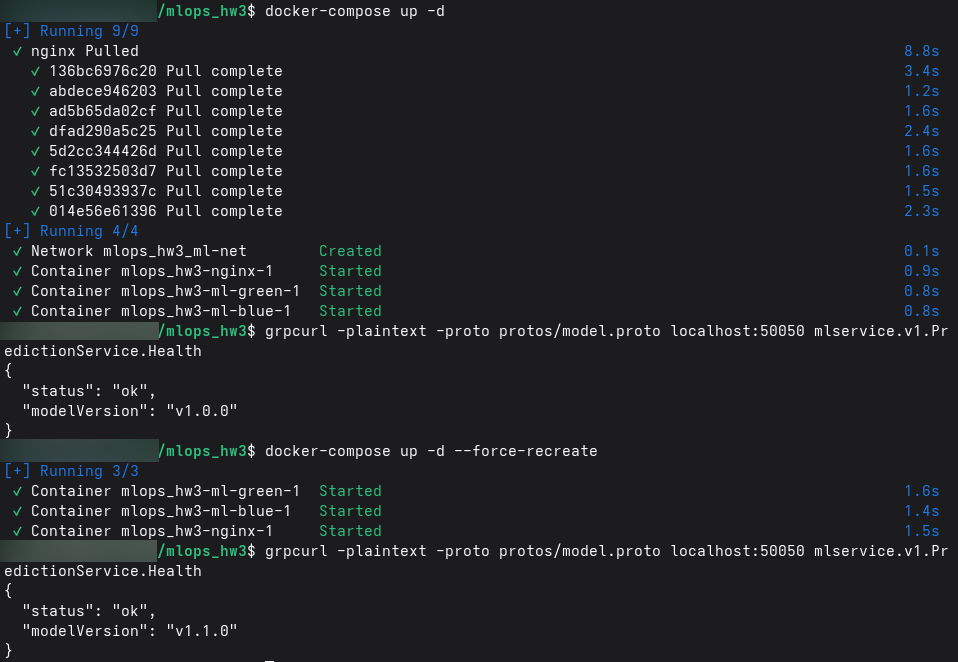
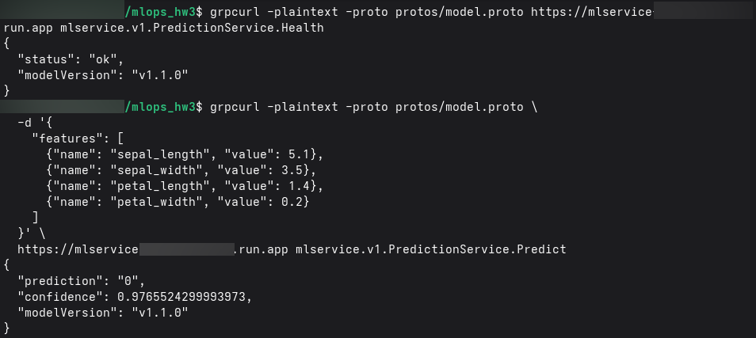

# gRPC ML Service: настройка стратегий развертывания модели и CI/CD-деплоя через GitHub Actions

Сервис реализует gRPC-сервер для выполнения предсказаний с помощью предварительно обученной модели машинного обучения. Сервер предоставляет два endpoint'а:
- `/health` — проверка работоспособности сервиса и версии модели.
- `/predict` — выполнение предсказаний по переданным признакам.

Сервис полностью контейнеризован с помощью Docker и готов к развёртыванию.

## Сборка и запуск

```bash
# 0. Клонирование репозитория
git clone https://github.com/mipt-bio3/mlops_hw3
cd mlops_hw3/

# 1. Установка зависимостей и подготовка артефактов
pip install -r requirements.txt --no-input
python create_model.py
python -m grpc_tools.protoc -I./protos --python_out=./protos --grpc_python_out=./protos ./protos/model.proto

# 2. Сборка Docker-образа
docker build -t grpc-ml-service .

# 3. Запуск контейнера
docker run -p 50051:50051 grpc-ml-service
```

## Стратегия развертывания

В данном репозитории используется стратегия Blue-Green.

```bash
# 1. Сборка Docker-образов
docker build -t grpc-ml-service:v1.0.0 -f Dockerfile_blue .
docker build -t grpc-ml-service:v1.1.0 -f Dockerfile_green .

# 2. Запуск Docker Compose с nginx в качестве балансировщика
docker-compose up -d

# 3. Проверка версии
grpcurl -plaintext -proto protos/model.proto localhost:50050 mlservice.v1.PredictionService.Health
# должен вернуть "modelVersion": "v1.0.0"

# 4. Для переключения на green - nginx.conf: proxy_pass grpc_blue; -> proxy_pass grpc_green;
#    и перезапуск Docker Compose
docker-compose up -d --force-recreate

# 6. Проверка версии
grpcurl -plaintext -proto protos/model.proto localhost:50050 mlservice.v1.PredictionService.Health
# должен вернуть "modelVersion": "v1.1.0"

# 7. Для отката - nginx.conf: proxy_pass grpc_green; -> proxy_pass grpc_blue;
#    и перезапуск Docker Compose
docker-compose up -d --force-recreate
```

## CI/CD

В данном репозитории используются GitHub Actions для автоматического развертывания сервиса в Google Cloud Run:

    **Триггер:** push в ветку main
    **Сборка:** создаётся Docker-образ и публикуется в GitHub Container Registry (GHCR)
    **Деплой:** образ разворачивается в облачный сервис GCP Cloud Run
    **Проверка:** после деплоя автоматически выполняется health-check по эндпоинту /health — сервис должен ответить статусом 200 OK

## Тестирование эндпоинтов

Проверка работоспособности сервиса (localhost):

```bash
# Проверка health-эндпоинтов с помощью grpcurl
# (выполнять после запуска контейнера)
grpcurl -plaintext -proto protos/model.proto localhost:50051 mlservice.v1.PredictionService.Health

grpcurl -plaintext -proto protos/model.proto \
  -d '{
    "features": [
      {"name": "sepal_length", "value": 5.1},
      {"name": "sepal_width", "value": 3.5},
      {"name": "petal_length", "value": 1.4},
      {"name": "petal_width", "value": 0.2}
    ]
  }' \
  localhost:50051 mlservice.v1.PredictionService.Predict
  ```

Для проверки работоспособности сервиса после деплоя необходимо заменить `localhost:50051` на адрес сервиса `https://path-to-service`

## Скриншоты





## Переменные окружения

- `PORT=50051` — порт gRPC-сервера
- `MODEL_PATH=/app/models/model_v1.1.0.pkl` — путь к файлу модели внутри контейнера
- `MODEL_VERSION=v1.1.0` — версия модели, возвращаемая в ответах
